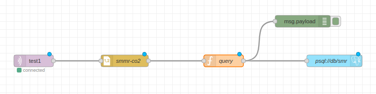
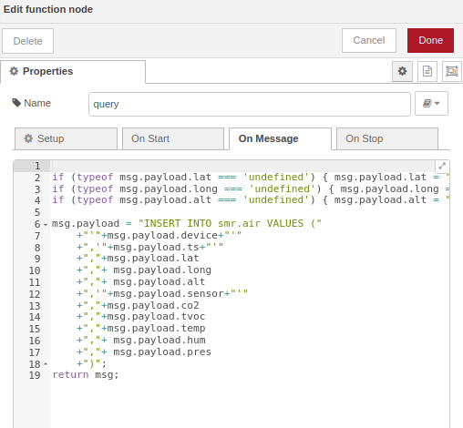
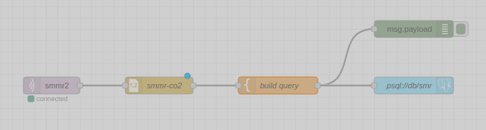
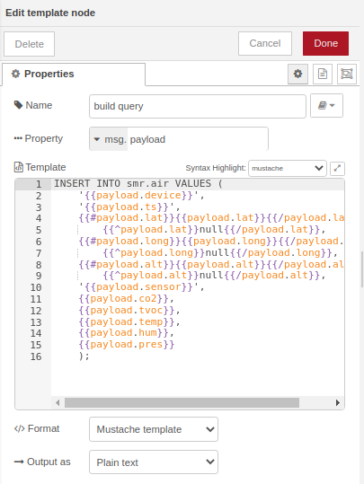
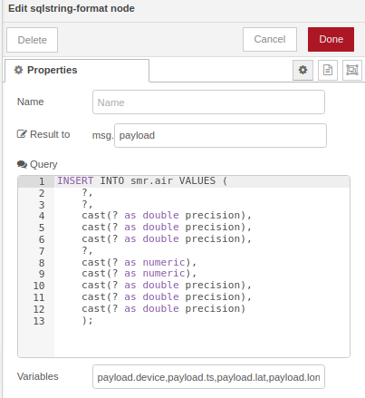
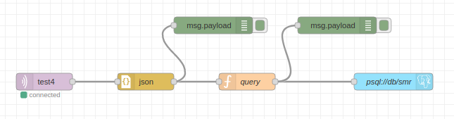
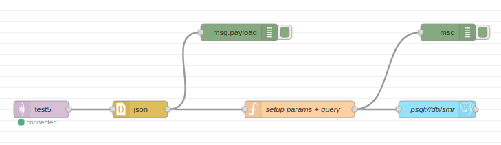
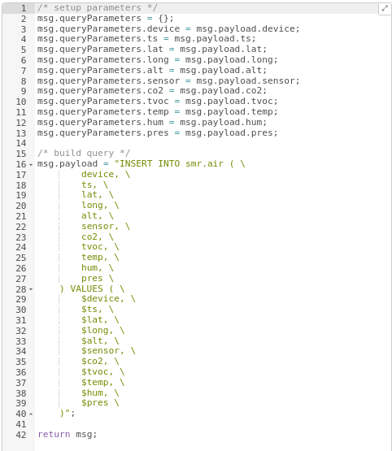

# Avoiding SQL Injections: MQTT + Node-red + SQL database.

## Introduction

Last year I have been working on an embedded solution of remote sensing electric and physical parameters. In [this](https://sguarin.github.io/presentaciones/seguridad-mqtt/) presentation I talked about differents aproachs to implement MQTT/TLS connection with authentication validation between an embedded solution and a broker. The examples were presented using ESP32 and the arduino framework.

The entire solution was originaly conceived as an embedded system, a python service and an ELK stack (Elasticsearch, Logstash and Kibana). I needed to implement an escalable flow from MQTT messages to a PostgreSQL database using Node-red, in order to adapt the embedded solution to an infrastructure currently used by the customer.

The following research consists in testing sql injections via MQTT using Mosquitto, Node-red and PostgreSQL in a docker composed lab, but it can be extended to other implementations.  The messages are received via MQTT broker, processed in Node-red and stored on a SQL database.

I explored differents Node-red flows found implemented on the customer and in different tutorials/resources found on internet.

I noticed that security on MQTT is not taken seriously as in http/web. There are a lots of free and open brokers sometimes used for production. Knowledge of valid messages are available to anyone getting subscribed to the topic. An attacker could view and use that kwnowledge to replay the messages trying some injections.

After testing against sql injections, I will present some vulnerable scenarios, mitigations and good implementations.

The laboratory provided in this repository requires docker-compose, and instantiates three containers:
* Mosquitto broker without authentication exposed on port 1884
* Node-red without authentication exposed in port 1881
* Postgresql with with a testing database smr exposed in port 5433., accesed with user:smmruser, and password:smmruser00

All services are exposed for academic testing purposes. You can use or adapt this lab, to test your implementations.

## Starting environment

You can run the clients inside the container or you can install mosquitto and postgresql client on your computer. The commands presented uses the second aproach.

The lab can be cloned from: [https://github.com/sguarin/machine-mqtt-node-red/](https://github.com/sguarin/machine-mqtt-node-red/)

For each test, you can reset and start a fresh scenario by stopping (CTRL-C on docker-compose terminal) and running again:

```
docker-compose up -V
```

After the containers started, you can connect to the database running the following command and using 'smmruser00' as password:

```
psql -h localhost -p 5433 -U smmruser -d smr
```

Once connected to the database, you can check the initial 10 records in the table smr.air by running:

```
select * from smr.air;

```

You will get:
```
smr=# select * from smr.air;
 device |         ts          | lat | long | alt | sensor | co2 | tvoc | temp  |  hum  |   pres    |        imported_on         
--------+---------------------+-----+------+-----+--------+-----+------+-------+-------+-----------+----------------------------
 bme680 | 2021-04-18 00:00:01 |     |      |     | co2    | 765 |    1 |  35.1 | 40.58 |    101451 | 2021-04-17 21:00:01.008461
 bme680 | 2021-04-18 00:00:02 |     |      |     | co2    | 764 |    1 | 35.09 | 40.61 |    101455 | 2021-04-17 21:00:02.009756
 bme680 | 2021-04-18 00:00:03 |     |      |     | co2    | 768 |    1 |  35.1 | 40.58 |    101453 | 2021-04-17 21:00:03.009452
 bme680 | 2021-04-18 00:00:04 |     |      |     | co2    | 772 |    1 | 35.09 | 40.62 |    101451 | 2021-04-17 21:00:04.013557
 bme680 | 2021-04-18 00:00:05 |     |      |     | co2    | 772 |    1 | 35.09 | 40.62 |    101451 | 2021-04-17 21:00:05.009002
 ccs811 | 2021-04-18 00:00:01 |     |      |     | co2    | 413 |    1 | 30.81 |  61.8 | 101483.88 | 2021-04-17 21:00:00.846486
 ccs811 | 2021-04-18 00:00:02 |     |      |     | co2    | 418 |    2 | 30.81 |  61.8 | 101480.47 | 2021-04-17 21:00:01.8454
 ccs811 | 2021-04-18 00:00:03 |     |      |     | co2    | 418 |    2 |  30.8 |  61.8 |  101479.3 | 2021-04-17 21:00:02.851117
 ccs811 | 2021-04-18 00:00:04 |     |      |     | co2    | 415 |    2 |  30.8 |  61.8 | 101480.59 | 2021-04-17 21:00:03.845351
 ccs811 | 2021-04-18 00:00:05 |     |      |     | co2    | 406 |    0 |  30.8 |  61.8 | 101481.78 | 2021-04-17 21:00:04.848899
```

Optionaly, you can connnect to http://localhost:1881 to interact in Node-red web gui and play around with each implementation.

After you got the lab running, you can run each test by running the apropiate mosquitto client commands.

## Test 1: CSV + JS concatenation



This is the more basic aproach, we receive a comma separated value message, then we construct the query concatenating the values and feed the PosgreSQL node.



I was very surprised reading this aproach on lot of blogs and forums without noticing the security issues involved.

In a normal use, you can simulate a message running the following command on your host machine:

```
mosquitto_pub -h localhost -p 1884 -t test1 -m "ccs811,2021-04-18 01:33:57,,,,co2,1559,212,31.61,59.83,101543.27"
```

You can now verify, that there are 11 records on the table with the query command described previosly.

After running the following simple attack you can verify that all records were deleted on the database.

```
mosquitto_pub -h localhost -p 1884 -t test1 -m "ccs811,2021-04-18 01:33:57,,,,co2,1559,212,31.61,59.83,101543.27); delete from smr.air--"
```

Of course there is no reflection neither a blind response on this injection, so you can't guess the table name. I choosed this payload for academic purpose, but there are lots of payloads from testing for admin privileges, using postgresql functions, etc.

For example you can use pg_sleep to prevent the transaction from being commited inmediately, getting the thread and connection resource blocked in an iddle state for x seconds.

```
mosquitto_pub -h localhost -p 1884 -t test1 -m "ccs811,2021-04-18 01:33:57,,,,co2,1559,212,31.61,59.83,101543.27); select pg_sleep(60)--"
```

Abusing with multiple use of this payload may get a denial of service.

## Test 2: CSV + Template block

The second aproach I found googling is using the Template node:





You can try the same MQTT messages on previous test but on topic test2 instead. You will get the same results.

## Test 3: SQLString Node


SQLString node is an optional node-red module already installed on the lab:
It works well on strings, but if you need to store numeric values you need to cast them back.



This aproach handles all parameters as strings, then does quote escaping ('co2'' as 'co2\'') and finally construct the query.
You can't use the dollar sign quote or other bypass techniques as it handles all the columns as strings adding two final quotes.

Is not very efficient because all the numeric values are treated as strings, so you need to cast them again back to numeric for proper storage.

An attempt to an injection may cause some logging overloads. Nothing serious.

I could not got a succesfull sql injection with this implementation.

## Test 4: JSON + JS concatenation



Similar as the first test case, but when I tried it, I was wondering if the json node block will do some sanity checks. Unfortunately not.

```
mosquitto_pub -h localhost -p 1884 -t test4 -m '{"device":"ccs811","ts":"2021-04-18 01:33:57","sensor":"co2","co2":1559,"tvoc":212,"temp":31.61,"hum":59.83,"pres":101543.27}'
```

Attack:

```
mosquitto_pub -h localhost -p 1884 -t test4 -m '{"device":"ccs811","ts":"2021-04-18 01:33:57","sensor":"co2","co2":1559,"tvoc":212,"temp":31.61,"hum":59.83,"pres":"101543.27);delete from smr.air --"}'
```

## Test 5: JS Separate query from params



Well, by definition this should be the first aproach. Separating the query from the parameters that can be injected from external entities is by definition the "defensive programming" against SQL injections.

At the time of this writing, the documentation of [node-red-contrib-re-postgres](https://flows.nodered.org/node/node-red-contrib-re-postgres) mention this, but lacks of some examples.
This is an example of building a dictionary with the parameters and on the other hand construct the query. The dictionary keys can be referenced from the query as $key.




Valid packet for testing:

```
mosquitto_pub -h localhost -p 1884 -t test4 -m '{"device":"ccs811","ts":"2021-04-18 01:33:57","sensor":"co2","co2":1559,"tvoc":212,"temp":31.61,"hum":59.83,"pres":101543.27}'
```

Rejected attack:

```
mosquitto_pub -h localhost -p 1884 -t test5 -m '{"device":"ccs811","ts":"2021-04-18 01:33:57","sensor":"co2","co2":1559,"tvoc":212,"temp":31.61,"hum":59.83,"pres":"101543.27);delete from smr.air --"}'
```

You can also test some payloads near a string parameter verifying that commands also can't be injected.

```
 ccs811 | 2021-04-18 01:33:57 |     |      |     | co2'); --     | 1559 |  212 | 31.61 | 59.83 | 101543.27 | 
 ccs811 | 2021-04-18 01:33:57 |     |      |     | co2$$a$$); -- | 1559 |  212 | 31.61 | 59.83 | 101543.27 | 
```

## Conclusion

Programming with gui frameworks open the posibility to program to more public. But unoficial tutorials or documentation tend to appear substancially, in this case with lot of security conccerns.

In my opinion the last aproach is the more suitable for dealing with MQTT and storing in SQL databases besides is not very well documented.

I hope this lab and tutorial helps to explain how injections could be performed via MQTT protocol.

## References

* https://owasp.org/www-community/attacks/SQL_Injection
* https://www.infigo.hr/files/INFIGO-TD-2009-04_PostgreSQL_injection_ENG.pdf

