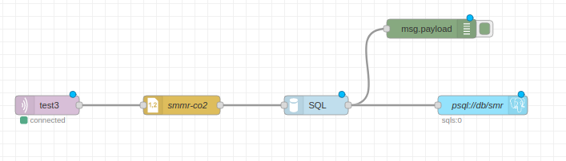

# Avoiding SQL Injections: MQTT + Node-red + SQL database.

## Introduction

I needed to implement an escalable flow from MQTT messages to a SQL database using Node-red, in order to adapt an embedded solution to an infrastructure currently used by the client.

The following research consists in testing sql injections via MQTT using mosquitto, node-red and PostgreSQL but it can be extended to other implementations.

I explored differents node-red flows implementations found on internet. The messesges are received via MQTT broker, processed in node-red and stored on a SQL database.

I noticed that security on MQTT is not taken seriosly as http/web ones. There are a lots of free and open brokers where some attacker can view messages and try some injections.

After testing against sql injections, I will present some vulnerable scenarios, mitigations and good implementations.

The laboratory provided in this repository requires docker-compose, and instantiates three containers:
* Mosquitto broker without authentication exposed on port 1884
* Node-red without authentication exposed in port 1881
* Postgresql with with a testing database smr exposed in port 5433., accesed with user:smmruser, and password:smmruser00

## Starting environment

You need to install mosquitto or mosquitto_client on your computer.

For each test, you can reset and start a fresh scenario by stopping (CTRL-C on docker-compose terminal) and running again:

```
docker-compose up -V
```

After the containers started, you can connect to the database running the following command and using 'smmruser00' as password:

```
psql -h localhost -p 5433 -U smmruser -d smr
```

Once connected to the database, you can check the initial 10 records in the table smr.air by running:

```
select * from smr.air;

```

You will get:
```
smr=# select * from smr.air;
 device |         ts          | lat | long | alt | sensor | co2 | tvoc | temp  |  hum  |   pres    |        imported_on         
--------+---------------------+-----+------+-----+--------+-----+------+-------+-------+-----------+----------------------------
 bme680 | 2021-04-18 00:00:01 |     |      |     | co2    | 765 |    1 |  35.1 | 40.58 |    101451 | 2021-04-17 21:00:01.008461
 bme680 | 2021-04-18 00:00:02 |     |      |     | co2    | 764 |    1 | 35.09 | 40.61 |    101455 | 2021-04-17 21:00:02.009756
 bme680 | 2021-04-18 00:00:03 |     |      |     | co2    | 768 |    1 |  35.1 | 40.58 |    101453 | 2021-04-17 21:00:03.009452
 bme680 | 2021-04-18 00:00:04 |     |      |     | co2    | 772 |    1 | 35.09 | 40.62 |    101451 | 2021-04-17 21:00:04.013557
 bme680 | 2021-04-18 00:00:05 |     |      |     | co2    | 772 |    1 | 35.09 | 40.62 |    101451 | 2021-04-17 21:00:05.009002
 ccs811 | 2021-04-18 00:00:01 |     |      |     | co2    | 413 |    1 | 30.81 |  61.8 | 101483.88 | 2021-04-17 21:00:00.846486
 ccs811 | 2021-04-18 00:00:02 |     |      |     | co2    | 418 |    2 | 30.81 |  61.8 | 101480.47 | 2021-04-17 21:00:01.8454
 ccs811 | 2021-04-18 00:00:03 |     |      |     | co2    | 418 |    2 |  30.8 |  61.8 |  101479.3 | 2021-04-17 21:00:02.851117
 ccs811 | 2021-04-18 00:00:04 |     |      |     | co2    | 415 |    2 |  30.8 |  61.8 | 101480.59 | 2021-04-17 21:00:03.845351
 ccs811 | 2021-04-18 00:00:05 |     |      |     | co2    | 406 |    0 |  30.8 |  61.8 | 101481.78 | 2021-04-17 21:00:04.848899
```

Optionaly, you can connnect to http://localhost:1881 to interact in Node-red web gui and play around with each implementation.

After you got the lab running, you can run each test by running the apropiate mosquitto client commands.

## Test 1: CSV + JS concatenation


This is the more basic aproach, we receive a comma separated value message, then we construct the query concatenating the values and feed the PosgreSQL node.


I was very surprised reading this aproach on lot of blogs and forums without noticing the security issues involved.

In a normal use, you can simulate a message running the following command on your host machine:

```
mosquitto_pub -h localhost -p 1884 -t test1 -m "ccs811,2021-04-18 01:33:57,,,,co2,1559,212,31.61,59.83,101543.27"
```

You can now verify, that there are 11 records on the table with the query command described previosly.

After running the following simple attack you can verify that all records were deleted on the database.

```
mosquitto_pub -h localhost -p 1884 -t test1 -m "ccs811,2021-04-18 01:33:57,,,,co2,1559,212,31.61,59.83,101543.27); delete from smr.air--"
```

Of course there is no reflection neither a blind response on this injection, so you can't guess the table name. I choosed this payload for academic purpose, but there are lots of payloads from testing for admin privileges, using postgresql functions, etc.

For example you can use pg_sleep to prevent the transaction from being commited inmediately, and get the thread and connection resource blocked in an iddle state for x seconds.

```
mosquitto_pub -h localhost -p 1884 -t test1 -m "ccs811,2021-04-18 01:33:57,,,,co2,1559,212,31.61,59.83,101543.27); select pg_sleep(60)--"
```

Abusing with multiple use of this payload may get a denial of service.

## Test 2: CSV + Template block

The second aproach I found googling is using the Template node:


You can try the same MQTT messages on previous test but on topic test2 instead. You will get the same results.

## Test 3: SQLString Node



Is an optional node-red module already installed on the lab:
It works well on strings, but if you need to store numeric values you need to cast them.


This aproach handles all parameters as strings, then does quote escaping ('co2'' as 'co2\'') and finally construct the query.
You can't use the dollar sign quote or other bypass techniques as it handles all the columns as strings adding two final quotes.

Is not efficient because all the numeric values are treated as strings, so you need to cast them again to numeric.

An attempt to an injection may cause some logging overloads. Nothing serious.

I did not got an sql injection with this implementation.

## Test 4: JSON + JS concatenation


Similar as the first case, but when I tried it, I was wondering if the json block will do some sanity checks. Unfortunately not.

```
mosquitto_pub -h localhost -p 1884 -t test4 -m '{"device":"ccs811","ts":"2021-04-18 01:33:57","sensor":"co2","co2":1559,"tvoc":212,"temp":31.61,"hum":59.83,"pres":101543.27}'
```


```
mosquitto_pub -h localhost -p 1884 -t test4 -m '{"device":"ccs811","ts":"2021-04-18 01:33:57","sensor":"co2","co2":1559,"tvoc":212,"temp":31.61,"hum":59.83,"pres":"101543.27);delete from smr.air --"}'
```

## Some of the resources

